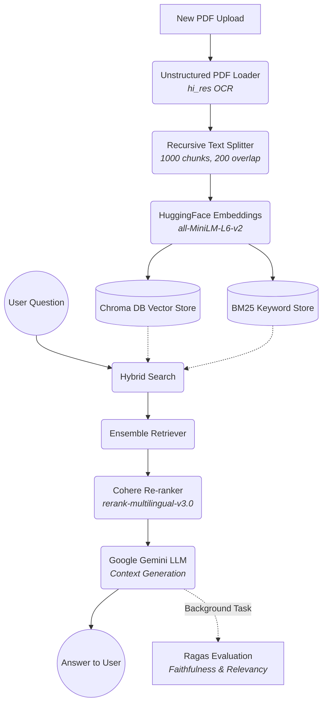

# PDF RAG PRO - Advanced Document Intelligence System

A full-stack hybrid Retrieval-Augmented Generation (RAG) system designed to accurately extract, retrieve, and analyze information from complex PDF documents (including tables, multi-column layouts, and images) using state-of-the-art AI models, hybrid search capabilities, and real-time automated answer evaluation.

## System Architecture

The project architecture is composed of two primary ecosystems: the **Full System Pipeline** that manages the application lifecycle, and the **Advanced RAG Pipeline** that drives the AI brain.

### 1. Full System Pipeline (Microservices)

The application utilizes a 3-tier microservice architecture to securely handle user requests, store history, and isolate heavy AI compute tasks:

*   **Frontend (React.js - Port 3000):**
    *   Provides a responsive user interface for uploading multiple PDF files and a chat interface for querying the documents.
    *   Communicates strictly with the Node.js middleware.
*   **Backend & Database (Node.js/Express & SQLite - Port 5001):**
    *   Acts as the orchestrator and data manager.
    *   Receives PDF files via `multer` and saves them locally.
    *   Maintains an SQLite database (`database.sqlite`) to track uploaded documents and store historical chat logs.
    *   Routes heavy AI ingestion and query requests to the Python microservice APIs.
*   **AI Engine (Python/FastAPI - Port 8000):**
    *   The core intelligence layer. Hosts the embedding models, vector stores, LLMs, and evaluation metrics.
    *   Exposes endpoints used by Node: `/api/ingest` (to process new PDFs), `/api/ask` (to generate answers), and `/api/evaluate_system` (for batch benchmarking).

### 2. Advanced RAG Pipeline (Inside Python Backend)

When a user asks a question, the data flows through an advanced multi-stage AI pipeline designed for maximum accuracy:



1.  **Ingestion & Parsing:** Uses `unstructured` with a `hi_res` strategy to run OCR on complex documents, ensuring data isn't lost in tables or images.
2.  **Chunking & Embedding:** Text is chunked and embedded locally using lightweight HuggingFace sentence-transformer models.
3.  **Hybrid Retrieval:** When queried, the system runs an *Ensemble Search*—combining dense Vector search (Chroma) for semantic meaning, and sparse Keyword search (BM25) for exact terminology.
4.  **Contextual Re-ranking:** The initial broad search results are passed through a `CohereRerank` model to highly optimize the chunk ordering, pushing the most relevant data to the absolute top.
5.  **Generation:** Google Gemini generates a strict answer using ONLY the provided re-ranked context.
6.  **Real-Time Evaluation:** Immediately after responding, a background thread uses the **Ragas** library to evaluate the LLM's response for `Faithfulness` (Did it hallucinate?) and `Answer Relevancy` (Did it actually answer the question?).

---

## How to Run Locally

To get the entire stack communicating and running on your local machine, follow these steps to spin up all three servers.

### Prerequisites
*   Node.js & npm installed
*   Python 3.10+ installed
*   A `.env` config file with your API keys placed in the Python root directory:
    ```env
    GOOGLE_API_KEY="your_gemini_key_here"
    COHERE_API_KEY="your_cohere_key_here"
    ```

### Step 1: Start the Python AI Engine (Terminal 1)
Open a terminal in the root project folder:

```bash
# 1. Activate your virtual environment
source venv/bin/activate

# 2. Install all strict dependencies
pip install -r requirements.txt

# 3. Ensure NLTK data is downloaded for Unstructured (One-time setup)
python -c "import nltk; nltk.download('punkt'); nltk.download('punkt_tab'); nltk.download('averaged_perceptron_tagger_eng'); nltk.download('stopwords')"

# 4. Start the FastAPI server
python advanced_rag.py
```
*(Leave this terminal running. The server operates on port 8000)*

### Step 2: Start the Node.js Backend (Terminal 2)
Open a new terminal and navigate to the node directory:

```bash
# 1. Enter directory
cd node-backend

# 2. Install dependencies
npm install

# 3. Start the Express server
node server.js
```
*(Leave this terminal running. The server operates on port 5001)*

### Step 3: Start the React Frontend (Terminal 3)
Open a new terminal and navigate to the frontend directory:

```bash
# 1. Enter directory
cd frontend

# 2. Install dependencies
npm install

# 3. Start the React development server
npm start
```
*(The UI will automatically open in your browser at `http://localhost:3000`)*

### You're ready!
You can now upload PDFs via the browser interface and converse with the system. Keep an eye on Terminal 1 (Python) to see real-time updates of chunking calculations, retrieval metrics, and Ragas background evaluation scores!
