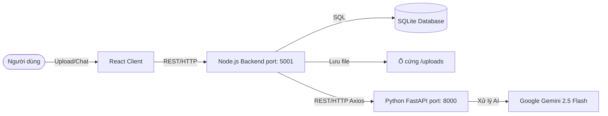

# Báo cáo Phân tích Chuyên sâu Kiến trúc Hệ thống PDF RAG PRO

**Tác giả:** AI Software Architect & AI Engineer
**Dự án:** Hệ thống RAG (Retrieval-Augmented Generation) thông minh

---

## 1. TỔNG QUAN KIẾN TRÚC (System Architecture)

### 1.1. Mô hình Kiến trúc: Microservices (Dạng nhẹ)
Hệ thống được thiết kế theo tư tưởng **Microservices**, tách biệt rõ ràng các mối quan tâm (Separation of Concerns). Mặc dù hệ thống có thể đang chạy cục bộ (localhost), việc chia nhỏ thành các services độc lập giúp hệ thống dễ bảo trì, dễ mở rộng (scale) và độc lập về công nghệ.

*Lý do thiết kế:* Xử lý AI/ML yêu cầu thư viện Python phức tạp và tài nguyên tính toán lớn (GPU/CPU), trong khi quản lý trạng thái, file tĩnh và CSDL lại rất phù hợp với I/O bất đồng bộ của Node.js.

### 1.2. Ba thành phần chính:
1. **Client (ReactJS):** Đảm nhiệm giao diện người dùng (UI), hiển thị tương tác tải file và chat.
2. **API Gateway & Trạng thái (Node.js - Port 5001):** 
   - Đóng vai trò như một API Gateway và Controller.
   - Quản lý việc lưu file vật lý, tương tác CSDL SQLite và điều phối request xuống AI Engine.
3. **AI Core Engine (FastAPI Python - Port 8000):**
   - Chuyên biệt hóa cho các tác vụ nặng: Ingestion (xử lý PDF, Vectorization), Retrieval (Hybrid Search, Re-ranking) và Generation (tương tác LLM).

### 1.3. Cơ chế giao tiếp
- Giao tiếp giữa React và Node.js thông qua REST API (`POST /api/upload`, `POST /api/chat`).
- Giao tiếp nội bộ giữa Node.js (5001) và Python (8000) cũng thông qua REST API (sử dụng thư viện `axios` trên Node.js). Node.js sẽ gọi `POST http://127.0.0.1:8000/api/ingest` để báo Python nạp file và `POST http://127.0.0.1:8000/api/ask` để truy vấn câu trả lời.

---

## 2. PHÂN TÍCH LUỒNG DỮ LIỆU ĐẦU VÀO (Data Ingestion Flow)

Khi người dùng bấm Upload trên giao diện UI, luồng xử lý diễn ra như sau:

1. **Tiếp nhận bằng Multer:** Node.js sử dụng middleware `multer` để nhận file PDF dưới dạng `multipart/form-data`, đặt tên file mới (ví dụ: `DOC-123456.pdf`) và lưu vào thư mục `/uploads`.
2. **Ghi nhận Database:** Node.js tạo bản ghi vào bảng `documents` trong SQLite để lưu vết ID và tên file.
3. **Ra lệnh cho AI Engine:** Node.js gửi đường dẫn tuyệt đối (absolute path) của file sang API `/api/ingest` của Python.
4. **Phân tích Document (Unstructured):** Python sử dụng `UnstructuredPDFLoader(strategy="hi_res")`. Đây là một điểm mạnh lớn so với `PyPDFLoader` thông thường, vì nó có khả năng **OCR**, bóc tách cấu trúc phức tạp như **bảng biểu (tables)**, bố cục hai cột và các hình ảnh có chứa văn bản một cách cực kỳ chi tiết.
5. **Cắt nhỏ dữ liệu (Chunking):** Để đưa vào mô hình vector và tránh vượt quá context window, hệ thống sử dụng `RecursiveCharacterTextSplitter`.
   - `chunk_size = 1000` ký tự.
   - `chunk_overlap = 200` ký tự (giữ lại ngữ cảnh giữa các chunk).
   - Tách theo các ranh giới tự nhiên: `["\n\n", "\n", ".", " "]`.

---

## 3. LỚP NHÚNG VÀ LƯU TRỮ VECTOR (Embedding & Vector Storage)

### 3.1. Mô hình Embedding (Vectorization)
Văn bản dạng chữ được biến đổi thành ngôn ngữ số (Vector) thông qua mô hình nhúng mã nguồn mở của HuggingFace: **`all-MiniLM-L6-v2`**. Mô hình này nhỏ gọn, tốc độ cực nhanh và rất hiệu quả cho tác vụ Semantic Search (tìm kiếm ngữ nghĩa).

### 3.2. Kiến trúc kho lưu trữ kép (Hybrid/Dual Storage)
Hệ thống không chỉ dùng một kho lưu trữ mà kết hợp hai chiến lược:
- **ChromaDB (Vector Store):** Lưu trữ mã nhúng Vector. Giúp hệ thống hiểu được *ý nghĩa* và *ngữ cảnh* của câu hỏi, kể cả khi người dùng dùng từ đồng nghĩa.
- **BM25Retriever (Keyword Store):** Thuật toán tìm kiếm từ khóa cổ điển dựa trên tần suất (TF-IDF cải tiến).

*Tại sao dùng song song?* Vector Search rất giỏi tìm ý nghĩa nhưng thường thất bại khi người dùng tìm chính xác các mã số đặc thù, tên riêng, từ viết tắt hoặc keyword cụ thể. Việc kết hợp cả hai (Hybrid) bù đắp khuyết điểm cho nhau.

---

## 4. QUÁ TRÌNH TRUY XUẤT VÀ TẠO SINH (Retrieval & Generation - RAG)

Khi người dùng đặt câu hỏi, một 파ipline RAG tinh vi được kích hoạt:

1. **Hybrid Search với Ensemble Weights:**
   - Hệ thống dùng `EnsembleRetriever` kết hợp kết quả từ BM25 và ChromaDB.
   - Dựa vào `config.yaml`, tỷ trọng (**ensemble weights**) được chia là **[0.4, 0.6]**, nghĩa là 40% ưu tiên tìm kiếm từ khóa (BM25) và 60% ưu tiên tìm kiếm ngữ nghĩa (Vector).

2. **Re-ranking (Sắp xếp lại) bằng Cohere:**
   - Kết quả thô từ Hybrid Search thường chứa các tài liệu ít liên quan ở đầu. Hệ thống dùng `CohereRerank` với mô hình `rerank-multilingual-v3.0`.
   - Cohere Reranker sẽ đọc lại các chunks và câu hỏi để chấm điểm liên quan (Re-score), sau đó chọn ra đúng **3 chunk tốt nhất** (`rerank_top_n: 3`) để đưa vào LLM. Điều này giảm thiểu chi phí token và tăng độ chính xác đáng kể.

3. **Chống "Ảo giác" (Hallucination) trong Generation:**
   - **Nhiệt độ (Temperature) = 0.0:** Cấu hình LLM (`gemini-2.5-flash`) chạy ở chế độ Deterministic (không sáng tạo), bắt buộc mô hình trả lời giống nhau trong mọi trường hợp.
   - **System Prompt Cực đoan:** Bắt buộc mô hình đóng vai là trợ lý và trả lời *STRICTLY ON THE CONTEXT BELOW* (tuyệt đối dựa vào ngữ cảnh). Nếu không có, bắt buộc nói chính xác câu: `"I couldn't find this information in the document."`

---

## 5. KIẾN TRÚC DATABASE (Database Architecture)

Hệ thống sử dụng **SQLite**, hệ quản trị cơ sở dữ liệu quan hệ nhẹ, chạy trực tiếp trên file `database.sqlite` cục bộ, rất phù hợp cho các kiến trúc vừa và nhỏ.

**Cấu trúc 2 bảng cốt lõi:**
1. **Bảng `documents`:** 
   - `id`, `filename`, `upload_date`.
   - Vai trò: Lưu trữ bằng chứng vật lý của file, ánh xạ giữa tên file thực tế và file đã mã hóa trên hệ thống thư mục (`DOC-xxx.pdf`).
2. **Bảng `chats`:**
   - `id`, `document_id` (Khóa ngoại), `user_query`, `ai_response`, `chat_date`.
   - Vai trò: Duy trì toàn bộ lịch sử (History State) của các phiên hỏi đáp, làm cơ sở để phân tích hành vi người dùng, hoặc bổ sung tính năng Chat History (Lịch sử trò chuyện) về sau.

---

## 6. HỆ THỐNG ĐÁNH GIÁ NGẦM (Background Evaluation)

Một tính năng xuất sắc của hệ thống này là khả năng tự đánh giá (Auto-Evaluation) mà không ảnh hưởng tới người dùng.

### 6.1. Cơ chế chạy ngầm (BackgroundTasks)
Trong FastAPI (`/api/ask`), sau khi đã có câu trả lời từ LLM, API ngay lập tức gửi phản hồi về cho Node.js (và React) để hiện lên màn hình. Đồng thời, nó ném hàm `evaluate_single_interaction` vào **BackgroundTasks**.

### 6.2. Đánh giá tự động bằng Ragas
Trong lúc hệ thống nghỉ ngơi, Ragas (sử dụng Gemini làm Judge LLM) sẽ phân tích 2 chỉ số quan trọng:
- **Faithfulness (Độ trung thực):** Đo lường xem câu trả lời của AI có hoàn toàn bắt nguồn từ Context (tài liệu PDF) hay không, hay đang "bịa" ra thông tin.
- **Answer Relevancy (Độ bám sát câu hỏi):** Đánh giá câu trả lời có trực tiếp giải quyết câu hỏi của người dùng không, hay đang lan man, dài dòng không cần thiết.

*Kết luận:* Tính năng đánh giá ngầm này giúp cho Đội ngũ phát triển (Kỹ sư AI) thu thập được chỉ số chất lượng thực tế (Real-time Metric) trong môi trường Production để liên tục tinh chỉnh Prompt và Chunking.
